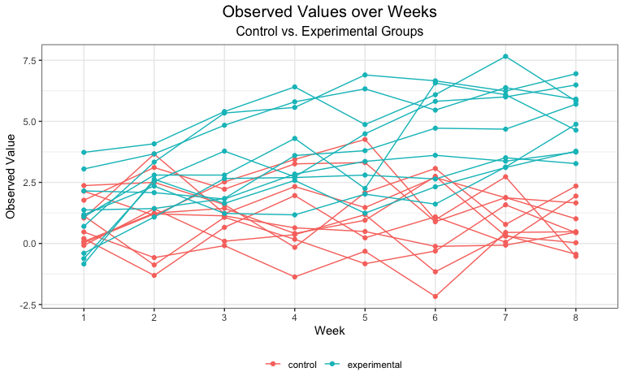

p8105\_hw5\_zl2978
================

## Problem 1

I will first read the raw data.

``` r
homicide_raw = read_csv("data/homicide-data.csv")
```

    ## Parsed with column specification:
    ## cols(
    ##   uid = col_character(),
    ##   reported_date = col_double(),
    ##   victim_last = col_character(),
    ##   victim_first = col_character(),
    ##   victim_race = col_character(),
    ##   victim_age = col_character(),
    ##   victim_sex = col_character(),
    ##   city = col_character(),
    ##   state = col_character(),
    ##   lat = col_double(),
    ##   lon = col_double(),
    ##   disposition = col_character()
    ## )

There are 52179 rows and 12 columns in this dataset. The variables
includes the basic information of the victim (such as name, age, race,
and sex), event id, location of the homicide (state, city, longitude and
latitude), date of the homicide and description of the disposition.

Then I will create a city\_state variable.

``` r
homicide_df = 
  homicide_raw %>% 
  mutate(
    city_state = str_c(city, state, sep = ","),
    resolved = case_when(
      disposition == "Closed without arrest" ~ "unsolved",
      disposition == "Open/No arrest"        ~ "unsolved",
      disposition == "Closed by arrest"      ~ "solved",
    )) %>% 
  group_by(city_state) %>% 
  summarize(
    hom_total = n(),
    hom_unsolved = sum(resolved == "unsolved")
  ) %>% 
filter(city_state != "Tulsa,AL")
```

    ## `summarise()` ungrouping output (override with `.groups` argument)

Then I will run a prop.test.

``` r
BMD_test = 
  prop.test(
  homicide_df %>% filter(city_state == "Baltimore,MD") %>% pull(hom_unsolved), 
  homicide_df %>% filter(city_state == "Baltimore,MD") %>% pull(hom_total)) %>% 
  broom::tidy()
pull(BMD_test,estimate)
```

    ##         p 
    ## 0.6455607

``` r
pull(BMD_test,conf.low)
```

    ## [1] 0.6275625

``` r
pull(BMD_test,conf.high)
```

    ## [1] 0.6631599

Then I will do prop.test for every city.

``` r
results_df = 
  homicide_df %>% 
  mutate(
    prop_tests = map2(.x = hom_unsolved, .y = hom_total, ~prop.test(x = .x, n = .y)),
    tidy_tests = map(.x = prop_tests, ~broom::tidy(.x))
  )%>% 
  select(-prop_tests) %>% 
  unnest(tidy_tests) %>% 
  select(city_state, estimate, conf.low, conf.high)
```

Finally, I will create the plot

``` r
results_df %>% 
  mutate(city_state = fct_reorder(city_state, estimate)) %>% 
  ggplot(aes(x = city_state, y = estimate)) +
  geom_point() + 
  geom_errorbar(aes(ymin = conf.low, ymax = conf.high)) + 
  theme(axis.text.x = element_text(angle = 90, vjust = 0.5, hjust = 1))
```

<!-- -->

## Problem 2

I will create a dataframe that contains information for each file and
tidy the data.

``` r
path_df = 
  tibble(
    path = list.files("data/problem2_data")
  ) %>% 
   mutate(
    path = str_c("data/problem2_data/", path),
    data = map(.x = path, ~read_csv(.x)),
    subject_id = substr(path,24,25),
    arm = substr(path,20,22),
    arm = recode(arm, "con" = "control", "exp" = "experimental")) %>%
  select(-path) %>% 
  relocate(subject_id,arm) %>% 
  unnest(data) %>% 
  pivot_longer(
    week_1:week_8,
    names_to = "week",
    values_to = "value",
    names_prefix = "week_"
  )
```

For cleaning the data, I have created an arm variable and a week
variable which make the data from wider to longer.

Then I will make a spaghetti plot.

### Spaghetti plot

``` r
path_df %>% 
  mutate(ID = str_c(arm,subject_id)) %>% 
ggplot(aes(x = week, y = value, color = arm, group = ID)) +
  geom_line() +
  geom_point() +
  labs(
    x = "Week",
    y = "Observed Value",
    title = "Observed Values over Weeks",
    subtitle = "Control vs. Experimental Groups"
  ) 
```

<!-- -->

As we can see from the plot, in the control arm, the variation of each
person over 8 weekes is within a certain interval, and the overall
trends is not increasing or decreasing. In the experimental arm, there
is a general increasing trend for each individual over the eight weeks.
Besides, there is not a significant difference between the initial
values of the control arm and experimental arm, but the value of the
experimental arm is generally higher than the control arm since week 4,
and at the end of the experiment, all of the value of the experimental
arm is higher than than of the control arm.
